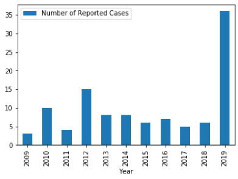
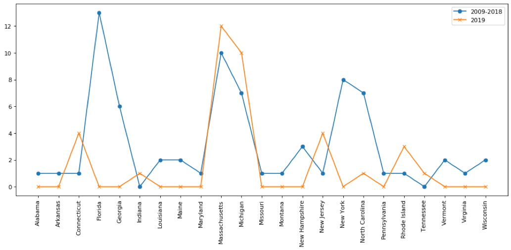

# Eastern Equine Encephalitis virus: Outbreak or Outlier

### Background:
Eastern Equine Encephalitis (EEE) is an infection of the brain caused by Eastern Equine Encephalitis Virus (EEEV) with a fatality rate of approximately 35%.  EEEV is transmitted by an infected mosquito. As the name indicates EEEV infects horses leading to death in most of the cases. However, horses are not the reservoir for EEEV, most horses are vaccinated for EEEV and viral load of EEEV is insufficient to infect mosquitoes. Instead, EEEV Infected wild birds are mostly asymptomatic but have high viral load such that mosquitoes that feed on them can transmit the virus. The species of mosquito Culiseta melanura that feed on wild birds are particular about its blood source and rarely feed on human after blood meal from an infected bird. Generally, EEE occurs in Massachusetts, New York, Michigan, North Carolina, and Florida. Distribution of EEE overlaps with presence of Culiseta melanura mosquitoes in these regions.
	Although average number of EEEV infection in the U.S. has been approximately 7 infections per year, 2019 has seen a significant increase in EEEV infection in humans. So far this year, 36 infections and 14 fatality has been confirmed (figure 1.), exceeding number of infections seen in any year in the last 50 years. (figure 2.)
	Goal of this capstone project is to analyze different factors that could have resulted in  significant increase in incidences of EEEV infection in Massachusetts and Michigan.  Various factors such as climate change, changes in mosquito distribution, population, habitat. Changes in EEEV reservoir, specifically bird population, changes in bird migration, distribution of bird species, factors that could elucidate the sudden increase in EEEV infections in Massachusetts and Michigan.

### Motivation:
In 1999 there was an outbreak of Encephalitis caused by West Nile virus (WNV) in New York City. Before the outbreak, high fatality rate had been observed among birds around New York City. Pathologic assessment of the dead birds showed encephalitis, however West Nile virus was not tested for being it was rarely found in the US. Genomic analysis post-outbreak revealed that birds were infected with identical WNV that caused human outbreak of WNV. Since the introduction of WNV in North America in 1999, WNV has spread throughout the US. In 2002 season there were 4156 human cases resulting in 2354 cases of encephalitis and 284 deaths. I will use multiple sources of data to analyze whether sudden spike in EEEV infection observed in 2019 is a harbinger of what is to come similar to what we observed with WNV infection or just an outlier.  Analysis will focus on multiple factors that might have influenced the sudden increase in EEEV infection, focusing on Massachusetts and Michigan, where majority of the cases occurred in 2019. 
 
 
 
Fig 1.) Total EEE cases by year
 

 
 
Fig 2.) Comparison of Total EEE cases in (2009-2018) and 2019

 
### Data Question:
Distribution of human EEE cases year by year, are there clusters of human cases, is there hotspots or is it widespread, is there hotspots within the state of Massachusetts and Michigan.
How did climate change influence population, distribution, habitat of mosquitoes.
How did climate change influence migration pattern, population distribution of wild birds.

### Data Sources:
	Center for Disease Control (CDC)
	National Oceanic and Atmospheric Administration (NOAA)
	Division of Vector-Borne Diseases (DVBD)
	World Health Organization (WHO)
	United States Environmental Protection Agency (EPA)
	National Center for Emerging and Zoonotic Infectious Diseases (NCEZID)
	Department of Public Health, state of Massachusetts
	Michigan Department of Health and Human Services
	National Audubon Society
